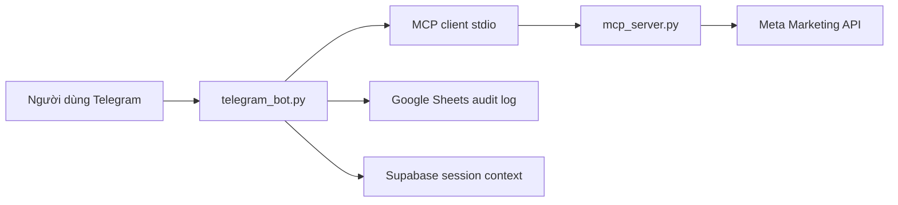

# Meta Ads MCP + Telegram Bot

Project này tạo một MCP server nội bộ để quản lý Meta/Facebook Ads qua Meta Marketing API, rồi cho Telegram bot gọi các MCP tools đó bằng lệnh chat.

## Trạng thái chức năng

Đã có trong code:

- Chiến dịch tin nhắn, chuyển đổi, leads, traffic bằng lệnh tạo campaign theo goal.
- Chế độ test an toàn `SAFE_MODE=true`: bot chỉ preview/dry-run, không tạo campaign live.
- Tạo campaign thật khi `SAFE_MODE=false` và lệnh có `CONFIRM_LIVE`; campaign vẫn được tạo ở trạng thái `PAUSED`.
- Kiểm tra trạng thái `campaign`, `adset`, `ad`.
- Xem campaign, ad set, ad.
- Xem insights theo ngày ở cấp `campaign`, `adset`, hoặc `ad`.
- Phân tích winner/loser và chọn kết quả tốt nhất theo goal `messages`, `conversions`, hoặc `leads`.
- Ghi log thao tác vào Google Sheets nếu bật cấu hình.
- Lưu ngữ cảnh phiên chat vào Supabase nếu bật cấu hình.

Chưa tự động tạo full funnel ad set + creative + ad hoàn chỉnh, vì phần đó cần thêm page id, pixel id, conversion event, creative asset, targeting, budget, schedule và quy trình duyệt nội bộ. Bộ này đã đặt nền để mở rộng các tool đó an toàn.

## Kiến trúc



## Cài đặt

```powershell
python -m venv .venv
.\.venv\Scripts\Activate.ps1
pip install -r requirements.txt
Copy-Item .env.example .env
```

Sửa `.env`:

```dotenv
TELEGRAM_BOT_TOKEN=token_tu_BotFather
TELEGRAM_ALLOWED_USER_IDS=telegram_user_id_cua_ban

META_ACCESS_TOKEN=token_meta
META_GRAPH_API_VERSION=v22.0
DEFAULT_AD_ACCOUNT_ID=act_1234567890
BOT_TIMEZONE=Asia/Bangkok

SAFE_MODE=true
```

Lấy Telegram user id:

```powershell
Invoke-RestMethod "https://api.telegram.org/bot<TELEGRAM_BOT_TOKEN>/getUpdates"
```

## Chạy bot

```powershell
python telegram_bot.py
```

Bot dùng long polling, phù hợp chạy trên máy cá nhân hoặc VPS nhỏ.

## Lệnh Telegram

Bot hỗ trợ 2 kiểu thao tác:

- Nhắn tự nhiên như đang trao đổi với trợ lý.
- Dùng lệnh slash cố định như `/campaigns`, `/analyze`, `/activate`.

### Nhắn tự nhiên

Các câu mẫu:

```text
Hôm nay có bao nhiêu chiến dịch đang chạy?
So sánh camp nào tốt nhất 7 ngày qua
So sánh chiến dịch tin nhắn hôm nay
So sánh ngân sách chiến dịch
Trạng thái chiến dịch "Tên Camp"
Bật chiến dịch "Tên Camp"
Tắt chiến dịch "Tên Camp"
Tắt campaign 120000000000000
```

Khi hỏi chiến dịch đang chạy, bật/tắt hoặc xem trạng thái, bot sẽ trả ra tên campaign và ID để người dùng kiểm tra lại trong Ads Manager.

Khi `SAFE_MODE=true`, câu "Bật chiến dịch..." chỉ trả về dry-run và hướng dẫn dùng `/activate campaign_id CONFIRM` sau khi đã đổi `SAFE_MODE=false`.

### Tạo chiến dịch từ tin nhắn Telegram

Cú pháp nhắn tự nhiên:

```text
Tạo chiến dịch tin nhắn tên "Camp inbox A" act_123456789 page https://facebook.com/tenpage bài viết https://facebook.com/tenpage/posts/123
Tạo chiến dịch chuyển đổi tên "Camp sale A" act_123456789 page https://facebook.com/tenpage bài viết https://facebook.com/tenpage/posts/123
```

Điều kiện bắt buộc:

- Tin nhắn phải có `act_...`.
- Phải có tên campaign trong dấu ngoặc kép sau chữ `tên`.
- Phải có link Page và link bài viết.
- Token Meta đang cấu hình phải truy cập được Page đó, và Page phải nằm trong danh sách `promote_pages` của tài khoản quảng cáo. Nếu tài khoản quảng cáo không có quyền quảng bá Page, bot sẽ báo lỗi và không tạo bản nháp.
- Mặc định bot chỉ tạo preview/dry-run, chưa tạo ad set, creative, ad live và chưa tiêu tiền.

Lý do chưa tạo ad live ngay từ link bài viết: để chạy thật cần thêm ngân sách, targeting, pixel/conversion event, optimization goal, billing event và bước duyệt trước khi bật. Phần campaign vẫn được tạo ở trạng thái `PAUSED` nếu dùng lệnh live.

### Lệnh slash

Xem dữ liệu:

```text
/start
/accounts
/campaigns act_123456789
/adsets campaign_id
/ads campaign_or_adset_id
/status campaign campaign_id
/status adset adset_id
/status ad ad_id
```

Xem và phân tích kết quả quảng cáo:

```text
/insights act_123456789 2026-05-01 2026-05-28 campaign
/insights act_123456789 2026-05-01 2026-05-28 adset
/insights act_123456789 2026-05-01 2026-05-28 ad

/analyze act_123456789 2026-05-01 2026-05-28 conversions campaign
/analyze act_123456789 2026-05-01 2026-05-28 messages adset
/compare act_123456789 2026-05-01 2026-05-28 leads ad
```

Nếu đã đặt `DEFAULT_AD_ACCOUNT_ID`, có thể bỏ `act_...`:

```text
/campaigns
/insights 2026-05-01 2026-05-28 campaign
/analyze 2026-05-01 2026-05-28 conversions campaign
```

Tạo chiến dịch test/dry-run:

```text
/draft_campaign act_123456789 messages "Camp tin nhan test"
/draft_campaign act_123456789 conversions "Camp chuyen doi test"
```

Tạo campaign thật:

```text
/create_campaign act_123456789 messages "Camp tin nhan live" CONFIRM_LIVE
/create_campaign act_123456789 conversions "Camp chuyen doi live" CONFIRM_LIVE
```

Điều kiện để tạo thật:

- `.env` phải có `SAFE_MODE=false`.
- Lệnh phải có `CONFIRM_LIVE`.
- Campaign vẫn được tạo ở trạng thái `PAUSED`; muốn chạy phải dùng `/activate`.

Bật/tắt campaign:

```text
/pause campaign_id CONFIRM
/activate campaign_id CONFIRM
```

Khi `SAFE_MODE=true`, lệnh `/activate` chỉ trả dry-run và không bật thật.

## Google Sheets audit log

Tạo Google service account, cấp quyền edit vào spreadsheet, rồi cấu hình:

```dotenv
GOOGLE_SHEETS_ENABLED=true
GOOGLE_SERVICE_ACCOUNT_FILE=C:\secure\service-account.json
GOOGLE_SHEET_ID=spreadsheet_id
GOOGLE_SHEET_TAB=bot_logs
```

Sheet nên có 6 cột:

```text
timestamp | user_id | chat_id | command | payload | result
```

Mỗi lệnh bot sẽ append một dòng log.

## Supabase session context

Tạo table:

```sql
create table if not exists bot_sessions (
  user_id text primary key,
  chat_id text,
  context jsonb not null default '{}'::jsonb,
  updated_at timestamptz not null default now()
);
```

Cấu hình:

```dotenv
SUPABASE_ENABLED=true
SUPABASE_URL=https://project-ref.supabase.co
SUPABASE_SERVICE_ROLE_KEY=service_role_key
SUPABASE_SESSION_TABLE=bot_sessions
```

Bot lưu `last_command`, `last_payload`, `last_result` theo từng Telegram user.

## Logic winner/loser

File `analytics.py` chuẩn hóa insights thành các metric:

- Spend, impressions, clicks, CTR, CPC, CPM.
- Messages, leads, purchases.
- Revenue, ROAS.
- Cost per message, cost per lead, cost per purchase.

Scoring:

- `messages`: ưu tiên nhiều conversation trên mỗi đồng spend.
- `leads`: ưu tiên nhiều lead trên mỗi đồng spend.
- `conversions`: ưu tiên ROAS, purchase volume, CPC thấp.

Kết quả trả về gồm `summary`, `best`, `winners`, `losers`.

## Yêu cầu quyền Meta

Bạn cần Meta Developer App có Marketing API và access token hợp lệ:

- `ads_read` để đọc account/campaign/insights.
- `ads_management` để tạo/sửa campaign.
- Token phải có quyền trên ad account.
- Nếu dùng cho business/người dùng khác, app/token cần qua quy trình review của Meta.

Tham khảo: [Meta Marketing API Postman collection](https://www.postman.com/meta/facebook-marketing-api/overview), [Meta campaign structure](https://developers.facebook.com/docs/marketing-api/campaign-structure), [Telegram Bot API](https://core.telegram.org/bots/api/).

## An toàn vận hành

- Giữ `SAFE_MODE=true` khi demo hoặc test.
- Không commit `.env`, service account JSON hoặc Supabase service role key.
- Chỉ thêm Telegram user id đáng tin vào `TELEGRAM_ALLOWED_USER_IDS`.
- Chạy live theo 2 bước: tạo campaign `PAUSED`, kiểm tra trong Ads Manager, rồi mới `/activate`.
- Nên thêm duyệt 2 người trước khi cho bot thay đổi ngân sách hoặc bật campaign live.

## Tác giả

Người thực hiện: **Danny DT (Thành Đạt)**
